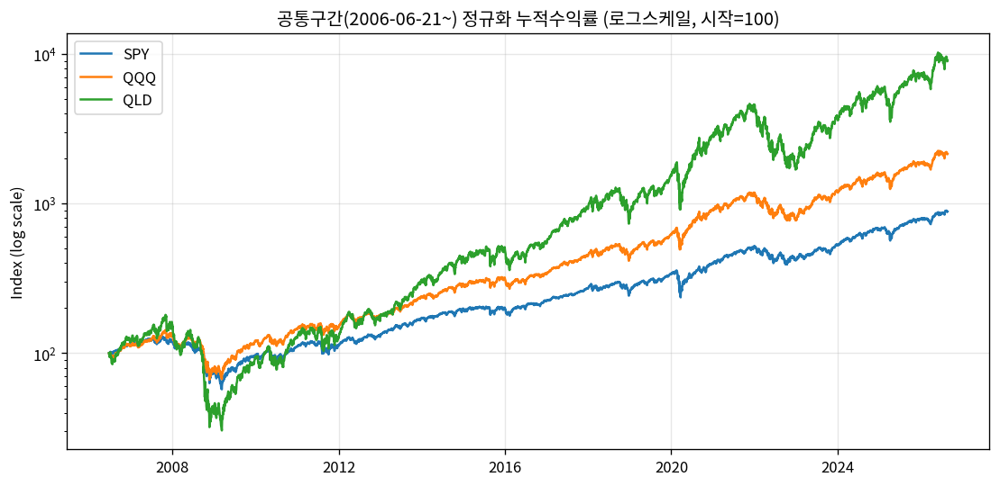
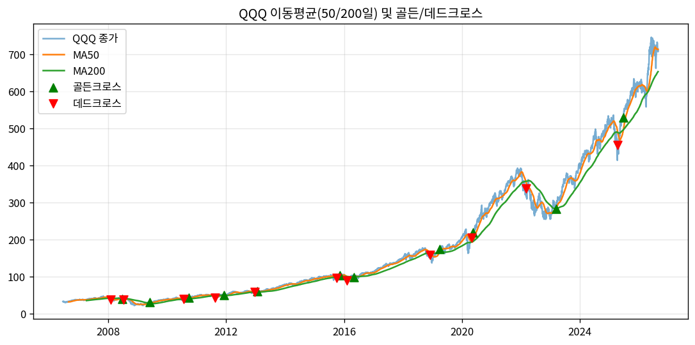
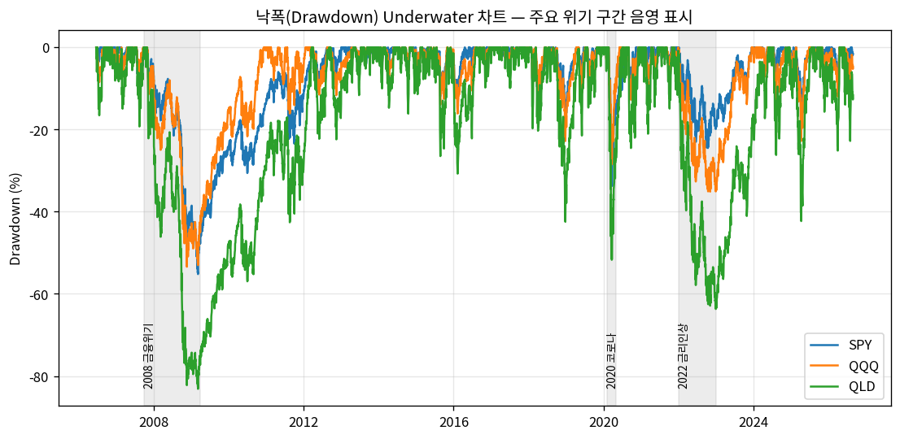
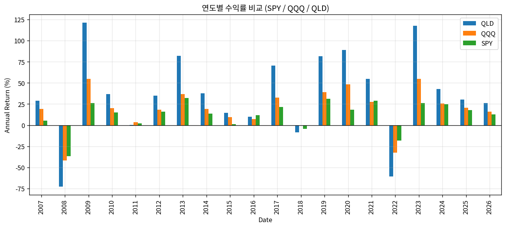
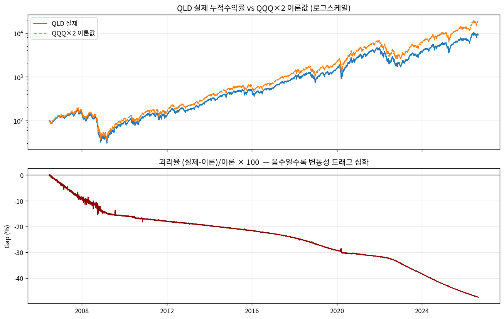
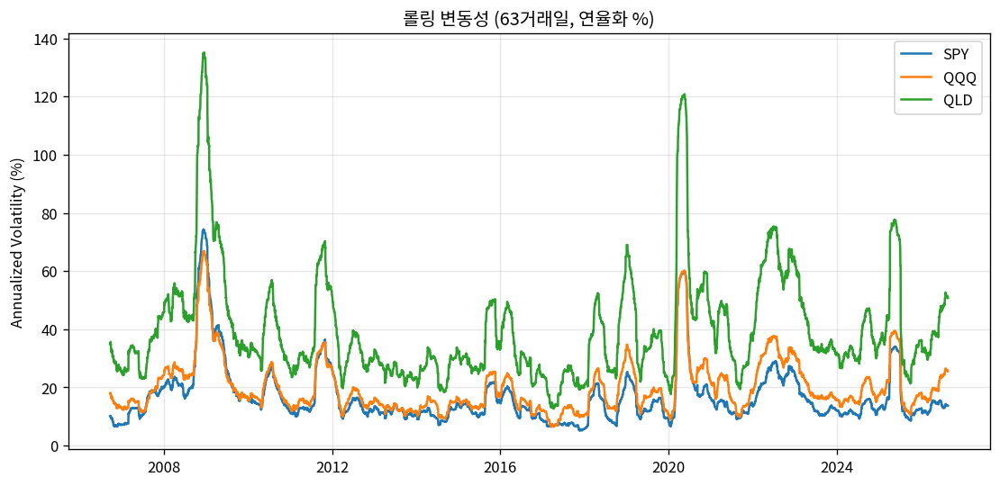
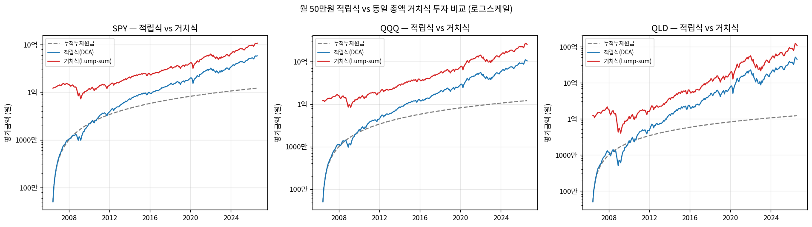
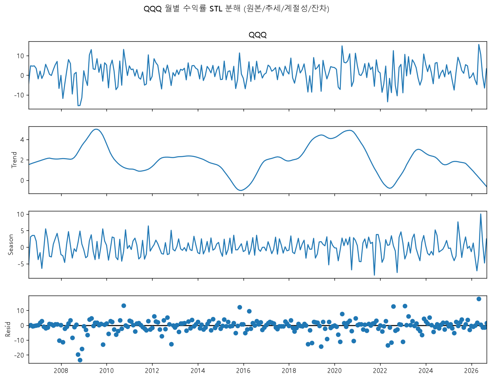
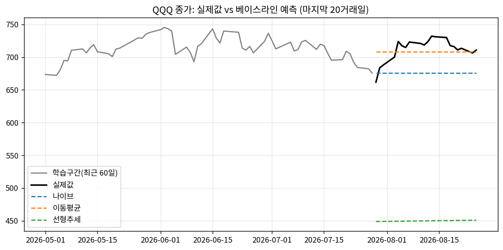

# SPY · QQQ · QLD 장기 수익률 비교 분석 리포트

## 📌1. 분석 주제

**✅S&P500 추종 ETF(SPY), 나스닥100 추종 ETF(QQQ), 나스닥100 2배 레버리지 ETF(QLD)의 장기 수익률·리스크 비교**

🔹핵심 스토리라인은 QQQ(원 지수)와 이를 2배로 추종하도록 설계된 QLD 사이의 **실제 수익률 괴리(변동성 드래그)를 분석**하고,    
🔹여기에 SPY(시장 전체 벤치마크)를 더해 "기술주 집중 vs 시장 전체", **"레버리지가 항상 유리한가"** 라는 질문에 답하는 것이다.   
🔹이 과제의 핵심은 그래프를 그리는 것이 아니라 **왜 이렇게 변했는가를 해석하는 것**이며,   
🔹아래 모든 서술은 그래프에서 확인한 사실(관찰)과 그에 대한 가설(해석)을 명확히 구분해서 작성했다.   

### 1-1. "분석 주제" 대응표

이 리포트는 하나의 통합된 분석 결과물이며, 제공된 "분석 주제 모음"의 여러 주제를 아래와 같이 조합해서 다룬다.

| 주제 모음 번호 | 주제 | 이 리포트에서의 대응 |
|---|---|---|
| 주제 1 | 장기 복리 수익률 비교 | 질문·관찰·해석 1 (§5-1) — SPY/QQQ/QLD 누적수익률·CAGR 비교 |
| 주제 2 | 위기 구간 낙폭·회복력 비교 | 질문·관찰·해석 2 (§5-2) — 2008/2020/2022 위기별 MDD·회복기간 |
| 주제 3 | 레버리지 ETF 변동성 손실 검증 | 질문·관찰·해석 4·5 (§5-4, §5-5) — QLD vs QQQ×2 이론값 괴리, 위험조정 수익 |
| 주제 4 | 적립식 vs 거치식 투자 비교 | 질문·관찰·해석 6 (§5-6) |
| 주제 5 | 금리 사이클과 ETF 수익률 | 질문·관찰·해석 3 (§5-3) — 2022년 금리인상기 QQQ vs SPY 하락폭 비교 (부분적으로 다룸) |

## 📌2. 분석 질문 (요약)

전체 질문은 아래 6개이며, 유사하거나 서로 이어지는 질문끼리 순서를 묶었다:   
**전체 수익률 개요(1) → 위기별 낙폭 비교(2) → 그 중 2022년 QQQ vs SPY 역전 현상을 깊이 보는 금리국면 분석(3) → 레버리지(QLD) 괴리 메커니즘(4) → 그래서 레버리지가 위험조정 기준으로 유리한가(5) → 마지막으로 투자 방식(적립식 vs 거치식, 6)**     
각 질문에 대한 그래프·관찰·해석은 §5에서 이 순서대로 하나씩 다룬다.

✅ **[관찰]** 공통구간(2006~2026) 동안 SPY, QQQ, QLD 각각의 누적 수익률과 연평균 복리 수익률(CAGR)은 얼마인가?  
✅ **[관찰]** 2008년 금융위기, 2020년 코로나 급락, 2022년 금리인상 하락장에서 세 상품의 최대낙폭(MDD)과 회복 소요기간은 각각 어떻게 다른가?  
✅ **[해석 필요]** (질문 2의 2022년 역전 현상을 이어서) QQQ(기술주 중심)와 SPY(시장 전체) 간 수익률 격차는 어떤 시기에 벌어지고 좁혀지는가?  
✅ **[해석 필요]** QLD의 실제 누적 수익률이 "QQQ 수익률의 2배"라는 이론값과 얼마나 차이 나는가? 어떤 시장 국면에서 괴리가 커지는가?  
✅ **[해석 필요]** (질문 4의 괴리 메커니즘을 이어서) 변동성 대비 수익률을 함께 볼 때, 장기 보유 관점에서 레버리지 ETF가 항상 유리한 선택이라고 할 수 있는가?  
✅ **[해석 필요]** *(주제 4)* 매월 정액을 나눠 투자하는 적립식(DCA)과, 동일한 총 투자금을 한 번에 투자하는 거치식(Lump-sum) 중 이 20년 구간에서는 어느 쪽이 유리했는가? "타이밍보다 기간이 중요하다"는 통념과 부합하는가?  

## 📌3. 데이터 설명

| 항목 | 내용 |
|---|---|
| 출처 | Yahoo Finance (`yfinance` 파이썬 라이브러리) |
| 가격 기준 | Adj Close (배당 재투자·액면분할 반영, 총수익 기준) |
| 개별 수집 범위 | SPY 1993.01.29 ~ 2026.08.25(8,450행),   QQQ 1999.03.10 ~ 2026.08.25(6,908행),   QLD 2006.06.21~2026.08.25(5,076행) |
| 핵심 비교구간(공통구간) | 2006-06-21 ~ 2026-08-25 (QLD 상장일 기준, 5,076거래일) |
| 수집 방법 | `data/fetch_data.py` (yfinance 자동 다운로드), 2026-08-26 로컬 환경에서 실행 |
| 결측치 | 공통구간 내 0건 (날짜 최대 공백 5일, 신정 연휴 등 정상 범위) — 각 상품의 상장 전 구간은 자연 결측이므로, 그 이슈 자체를 없애기 위해 핵심 비교는 3개 상품이 모두 존재하는 공통구간(2006~)만 사용했다. |
| 이상치 처리 | 일일 변화율 ±3표준편차 초과일은 "삭제하지 않고 플래그만" 남김 — SPY 83건, QQQ 76건, QLD 73건, 대부분 2008/2020/2022 위기 구간에 집중. 위기 국면의 급등락은 데이터 오류가 아니라 실제 사건이므로 삭제하면 분석 대상 자체가 왜곡되기 때문에, 삭제 대신 표시만 해서 이후 해석(§5-2)에 연결했다. |
| 라이선스 | Yahoo Finance 데이터, 비상업적 개인/학습 목적 사용 |

## 📌4. 적용한 시계열 기법

1. 누적수익률 정규화(공통구간 시작일=100 인덱싱) + 로그스케일 비교  
    3개 상품을 시작점이 다른 절대가격이 아니라 "동일 출발선"에서 비교하기 위해 사용 (§5-1)  
3. 이동평균선(50일/200일) 및 골든크로스·데드크로스 탐지  
    단기 변동에 가려지는 중장기 추세 방향과 전환 시점을 포착하기 위해 사용 (§5-1)  
5. 최대낙폭(MDD) 및 낙폭 곡선(underwater curve)  
    고점 대비 얼마나, 얼마나 오래 손실 상태였는지를 보기 위해 사용 (§5-2)  
7. 연도별 수익률 비교  
    위기 구간에서 나타난 순위 역전(질문2)이 특정 연도에 국한된 현상인지 확인하기 위해 사용 (§5-3)  
9. QLD 실제 vs QQQ×2 이론값 괴리 계산  
    레버리지 상품의 복리 손실(변동성 드래그) 메커니즘을 시간에 따라 추적하기 위해 사용 (§5-4)  
11. 롤링 변동성(63거래일, 연율화 표준편차)  
    위험의 크기 자체를 시간에 따라 비교해 위험조정 수익 논의의 근거로 삼기 위해 사용 (§5-5)  
13. *(보너스)* STL(Seasonal-Trend decomposition using LOESS)을 이용한 QQQ 월별 수익률 분해  
    추세·계절성·잔차(노이즈)를 분리해 "매년 반복되는 패턴"이 실재하는지 검증하기 위해 사용 (§6-A)  
15. *(보너스)* 나이브/이동평균/선형추세 베이스라인 예측  
    단순한 방법들이 얼마나 틀리는지를 보여줘 "단기 예측이 왜 어려운가"를 설명하기 위해 사용 (§6-B)  
17. *(추가, 주제 4)* 적립식(DCA) vs 거치식(Lump-sum) 투자 시뮬레이션 비교 (동일 총투자금 기준)  
    투자 "타이밍/방식"이 결과에 미치는 영향을 보기 위해 사용 (§5-6)  

## 📌5. 질문별 분석 결과 (그래프 → 관찰 → 해석)

### 5-1. 장기 수익률 서열과 그 대가 (질문 1)

📋**관찰**      
>  공통구간(2006-06-21~2026-08-25) 누적수익률은 SPY 784.80%(CAGR 11.41%), QQQ 2,048.91%(CAGR 16.42%), QLD 8,936.17%(CAGR 25.01%)였다.   
>  반면 연율화 변동성은 각각 19.38%, 22.08%, 43.96%로 수익률 순서와 정확히 같은 순서로 커졌다.   
>  두 번째 차트(이동평균 크로스)에서는 QQQ 기준 골든크로스 11회, 데드크로스 11회가 발생했는데, 크로스 발생 빈도 자체보다는 첫 번째 차트에서 보이는 장기 우상향 추세가 전체 그림을 지배한다.

💡**해석**     
>  20년이라는 초장기·전반적 강세장 구간에서는 기술주 집중(QQQ)과 레버리지(QLD)가 시장 전체(SPY)를 압도했지만, 이는 그만큼 큰 변동성을 감내한 대가로 보인다.   
>  표면적인 수익률 순위만으로 "레버리지가 우월하다"고 결론 내리기는 이르며, §5-5에서 위험 대비 수익으로 다시 검토한다.

### 5-2. 위기의 성격에 따라 다른 상품이 가장 취약했다 (질문 2)

📋**관찰**     
>  2008년 금융위기에서는 SPY -55.19%, QQQ -53.40%, QLD -83.13%(회복까지 1,106일)로 QLD가 압도적으로 깊게 하락했다.  
>  반면 2022년 금리인상 하락장에서는 QQQ(-34.83%)가 SPY(-24.50%)보다 더 크게 하락해, 순위가 위기 국면에 따라 뒤바뀌었다.  

💡 **해석**   
>  2008년은 시장 전체의 신용위기였기에 레버리지 구조 자체의 리스크(QLD)가 두드러졌고, 2022년은 금리 상승이 성장주·기술주 밸류에이션에 직접 타격을 준 국면이라 QQQ의 업종 집중 리스크가 두드러졌다.
>  즉 "어떤 상품이 위기에 가장 취약한가"는 위기의 원인에 따라 달라지며, 레버리지 리스크와 업종 집중 리스크는 서로 다른 메커니즘이다.
>  이 중 2022년의 QQQ vs SPY 역전 현상을 다음 질문(§5-3)에서 더 깊이 들여다본다.

### 5-3. 기술주 프리미엄은 금리 국면에 따라 프리미엄이 아니라 페널티가 된다 (질문 3)   

📋**관찰**   
>  장기적으로 QQQ는 SPY 대비 압도적 우위(누적 2,048.91% vs 784.80%)를 보였지만, 위 연도별 수익률 바 차트에서 2022년 한 해만 놓고 보면 QQQ가 SPY보다 10%p 이상 더 크게 하락했다(-34.83% vs -24.50%).  
>  §5-2에서 확인한 위기별 순위 역전이 2022년에 국한된 일시적 현상임도 이 차트에서 함께 확인된다.  

💡**해석**   
>  저금리·유동성 확장기에는 미래 성장에 대한 할인율이 낮아 기술주(QQQ 구성종목)의 프리미엄이 극대화되지만, 금리 인상기에는 동일한 메커니즘이 역방향으로 작동해 SPY보다 더 크게 조정받는다.  
>  QQQ의 장기 초과수익은 이러한 금리 국면 변화에 따른 비대칭적 리스크를 대가로 얻어진 것으로 해석된다.  

### 5-4. 변동성 드래그는 사건이 아니라 누적되는 구조 (질문 4)  

📋**관찰**   
>  QLD의 실제 누적수익률은 공통구간 종료 시점 기준 QQQ×2 이론값 대비 -47.44% 괴리돼 있었다.
>  위 괴리율 그래프는 계단식 급락이 아니라 거의 선형에 가깝게 꾸준히 우하향했고, 2008년 금융위기와 2022년 하락장 구간에서 기울기가 눈에 띄게 가팔라졌다.  

💡**해석**   
>  레버리지 ETF는 일간 수익률을 매일 재조정(rebalancing)하는 구조라, 변동성이 큰 국면일수록 복리 손실(변동성 드래그)이 빠르게 누적된다.  
>  이 괴리는 특정 사건 한 번으로 발생한 것이 아니라 20년 내내 꾸준히 진행된 구조적 현상이며, 보유 기간이 길어질수록 이론상 기대치와의 격차가 커질 수 있음을 시사한다.  
>  (단, QLD의 실제 운용보수(약 0.95%)도 괴리의 일부를 설명하므로, 순수 변동성 드래그만의 기여도는 아니다.)
>  이 메커니즘을 바탕으로 "그래서 레버리지가 위험 대비 유리한가"를 다음 질문(§5-5)에서 종합한다.   

### 5-5. 레버리지는 "항상 유리"하지 않다: 위험조정 수익 관점 (질문 5)  

📋**관찰**   
>  위 롤링 변동성 차트에서 QLD(빨강 계열)는 위기 국면마다 다른 두 상품보다 훨씬 큰 폭으로 치솟는다.    
>  실제로 CAGR을 연율화 변동성으로 나눈 단순 비율(수익/위험)은 SPY 0.589, QQQ 0.744, QLD 0.569로, 절대 수익률이 가장 높았던 QLD가 위험조정 기준으로는 오히려 SPY와 비슷하거나 더 낮았고, QQQ가 세 상품 중 가장 효율적이었다.
>  게다가 QLD의 MDD는 -83.13%로, 이는 100만원이 17만원까지 줄어드는 낙폭이다.  

💡**해석**   
>  레버리지 ETF는 강세장이 오래 지속될 때는 절대 수익을 극대화하지만, 감내해야 하는 변동성과 심리적 낙폭이 비선형적으로 커진다.
>  "장기적으로 우상향하니 레버리지가 유리하다"는 직관은 위험조정 관점에서는 성립하지 않으며, 실제로는 -80%대 낙폭을 버텨낼 수 있는지가 이론적 기대수익보다 더 중요한 변수로 보인다.  

### 5-6. 거치식이 이겼지만, 그건 "이 20년"이 상승장이었기 때문이다 (질문 6, 주제 4)

동일한 총 투자원금(월 50만원 × 243개월 = 1억 2,150만원) 기준 비교:

| 티커 | 총투자원금 | 적립식 최종가치 | 적립식 수익률(%) | 거치식 최종가치 | 거치식 수익률(%) |
|---|---:|---:|---:|---:|---:|
| SPY | 121,500,000원 | 579,176,657원 | 376.69 | 1,063,470,154원 | 775.28 |
| QQQ | 121,500,000원 | 1,049,723,606원 | 763.97 | 2,571,803,736원 | 2,016.71 |
| QLD | 121,500,000원 | 4,419,227,392원 | 3,537.22 | 10,709,422,155원 | 8,714.34 |

📋**관찰**   
>  동일한 총투자금(1억 2,150만원) 기준으로 비교하면, 거치식 수익률이 SPY 775.28%, QQQ 2,016.71%, QLD 8,714.34%로, 적립식(각각 376.69%/763.97%/3,537.22%)을 세 상품 모두에서 2배 이상 앞섰다.  

💡**해석**   
>  이 결과만 보면 "거치식이 항상 낫다"고 오해하기 쉽지만, 정확히는 "이번 20년 표본이 상승장 위주였기 때문에 돈을 더 일찍 넣을수록 유리했다"는 뜻에 가깝다.
>  거치식은 자금을 처음부터 전액 시장에 노출시키므로 상승장에서는 유리하지만, 반대로 투자 직후 큰 하락(예: 2008년 직전)이 온다면 훨씬 큰 심리적·재무적 충격을 받는다.
>  적립식(DCA)의 실질적 가치는 최종 수익률을 극대화하는 데 있는 것이 아니라, 특정 시점에 목돈을 한꺼번에 넣었다가 하필 그 직후 급락을 맞는 "매수 타이밍 리스크"를 시간에 걸쳐 분산시키는 데 있다.  
>  즉 두 방식은 수익률로 우열을 가릴 문제가 아니라 감내하려는 리스크의 종류가 다른 선택이다.

## 📌6. 보너스 결과

### 6-A. STL 분해 (QQQ 월별 수익률)

📋**관찰**   
>  대상은 QQQ 월별 수익률, 2006-07~2026-08 (242개월). 계절성 성분 표준편차 2.756, 잔차(노이즈) 성분 표준편차 4.760, **비율 0.579**. 월별 평균 계절성 성분(%): 1월 -1.16, 2월 -1.42, 3월 -0.63, 4월 +0.56, 5월 +1.69, 6월 -0.37, 7월 +0.28, 8월 -0.25, **9월 -1.84(최저)**, **10월 +2.65(최고)**, 11월 +1.09, 12월 -0.64.  

💡**해석**   
>  계절성 표준편차(2.76)가 잔차 표준편차(4.76)보다 작다는 것은, 월별 계절 패턴보다 설명되지 않는 노이즈(개별 이벤트, 거시 충격 등)의 변동폭이 더 크다는 뜻이다.  
>  즉 "특정 달에 반복되는 강세/약세 패턴"이 존재하긴 하지만(9월 약세·10월 강세 경향은 시장의 오랜 통념과 방향이 일치), 그 효과는 노이즈에 묻힐 정도로 상대적으로 약하다.  
>  **뚜렷한 계절성이 존재한다고 과장하기보다, "약한~중간 수준의 계절 패턴이 있으나 노이즈 대비 지배적이지는 않다"고 보는 것이 정확한 해석**이다.  
>  (12월의 계절성이 소폭 음수(-0.64)로 나온 것은 "연말 강세" 통념과는 다른 결과인데, 이는 이번 20년 표본에 2018년 12월, 2022년 12월처럼 유독 약했던 12월이 포함되어 평균을 끌어내렸을 가능성이 있다.)  

### 6-B. 베이스라인 예측 (QQQ 종가, 마지막 20거래일)

| 방법 | MAE |
|---|---|
| 나이브(직전값 유지) | 38.05 |
| 단순 이동평균(20일) | 14.16 |
| 선형추세 외삽 | 262.33 |

📋**관찰**   
>  세 가지 단순 예측 방법 중 이동평균(MAE 14.16)이 가장 오차가 작았고, 선형추세 외삽(MAE 262.33)이 가장 컸다.   

💡**해석**   
>  이동평균이 가장 낮은 오차를 보였지만, 이는 "예측을 잘했다"는 의미가 아니라 최근 20거래일 동안 가격이 특정 이동평균 부근에서 크게 벗어나지 않았다는 우연에 가깝다.  
>  선형추세 외삽이 가장 큰 오차를 보인 이유는 20년치 장기 상승 추세를 단 20거래일 앞으로 그대로 연장했기 때문에 실제 가격을 크게 과대추정했기 때문이다.  
>  세 방법 모두 정교한 모델이 아님에도 불구하고 방향에 따라 성능이 크게 갈린다는 사실 자체가, **단기 주가는 사실상 랜덤워크에 가까워 단순한 외삽으로는 예측하기 어렵다**는 효율적 시장 가설과 부합한다.  
>  이 예측 결과는 투자 판단의 근거로 사용할 수 없다.  

## 📌7. 결론 및 한계

**결론**   
✅ 20년(2006~2026) 공통구간에서 QQQ와 QLD는 SPY 대비 뚜렷한 초과수익을 냈지만, 그 초과수익은 더 큰 변동성·더 깊은 낙폭·구조적 변동성 드래그라는 대가를 수반했다.  
✅ 레버리지 상품(QLD)은 장기 강세장에서 절대 수익을 극대화할 수 있지만 위험조정 관점에서는 원 지수(QQQ)보다 못하며, -83%에 이르는 낙폭을 심리적·재무적으로 버텨낼 수 있는 투자자에게만 적합한 상품으로 보인다.  
✅ 투자 방식 측면에서는, 이번 표본 기간(대체로 상승장) 한정으로는 거치식이 적립식보다 수익률상 우위였지만, 이는 표본 기간의 특성일 뿐 "언제나 거치식이 낫다"는 일반 법칙이 아니며,  
✅ 적립식은 수익률 극대화가 아니라 매수 타이밍 리스크 분산이라는 다른 목적을 가진 전략으로 이해하는 것이 정확하다.  

**한계**  
- 과거 20년(주로 강세장 위주)의 결과이며, 미래 수익을 보장하지 않는다. 표본 기간이 특정 강세장에 편중된 생존 편향 가능성이 있다.
- QLD의 실제 운용보수·리밸런싱 비용을 별도로 분리하지 않아, 계산된 "이론값 대비 괴리"에는 순수 변동성 드래그 외에 비용 요인도 섞여 있다.
- STL 계절성 분석은 242개월이라는 상대적으로 짧은 표본에 기반하며, 강건성(robust=True)을 적용했음에도 특정 연도의 극단치가 월별 평균에 영향을 줬을 가능성이 있다.
- 베이스라인 예측은 성능 검증이 아니라 "예측의 어려움"을 보여주는 것이 목적이며, 실제 투자 전략으로 사용할 수 없다.
- 적립식 vs 거치식 비교는 거래수수료·세금·환율을 반영하지 않은 단순 시뮬레이션이며, 상승장이 지배적인 20년 표본이라는 특성상 결과가 거치식에 유리하게 기울어져 있을 수 있다(생존 편향과 동일한 한계 공유).

## 📌8. AI 사용 로그

| 사용 작업 | 사용 이유 | 검증 방법 |
|---|---|---|
| 데이터 수집 스크립트(`fetch_data.py`) 및 계산 함수(`src/metrics.py`) 초안 작성 | 반복적인 보일러플레이트 코드 작성 시간 절감 | 합성(랜덤워크) 데이터로 10개 단위테스트 작성 — CAGR·MDD·롤링변동성 등을 알려진 기대값과 대조해 검증 (예: 매년 10% 성장 시계열의 CAGR이 정확히 0.10으로 계산되는지 확인) |
| STL 분해·베이스라인 예측 코드 초안 | statsmodels 공식 API 사용법 및 구현 방식 시간 절감 | statsmodels 표준 API(`STL(...).fit()`) 그대로 사용, 실제 사용자 로컬 환경에서 재실행해 결과값(계절성/잔차 비율 0.579 등) 확인 |
| 인사이트 문장 작성 및 다듬기 | 관찰-해석 구조로 명확하게 서술하기 위한 표현 개선 | 각 인사이트에 언급된 모든 수치를 노트북 실행 결과(summary_df, mdd_df, crisis_mdd_df, gap_df, mae_table)와 직접 대조해 확인 |
| 데이터 수집 방식 트러블슈팅 (클라우드 환경 네트워크 제약 우회) | 클라우드 작업 환경에서 Yahoo Finance/PyPI 접근이 차단되어, 로컬 실행 방식으로 우회하는 절차 설계 | 사용자가 로컬에서 직접 실행한 `fetch_data.py`/`run_stl.py` 콘솔 출력과 파일 행수를 대조해 정상 수집 여부 확인 |
| 적립식(DCA) vs 거치식(Lump-sum) 비교 함수(`dca_vs_lumpsum`) 및 시각화 추가 (주제 4) | 제공된 "분석 주제 모음" 중 주제 4를 추가로 포함하고 싶다는 요청에 따라, 기존 코드를 재작성하지 않고 확장하는 형태로 구현 | 실제 공통구간 데이터로 직접 실행해 SPY/QQQ/QLD 3개 티커의 적립식·거치식 최종가치·수익률을 산출하고, 총투자원금이 두 방식에서 동일한지(=1억 2,150만원) 별도로 검산 |
| 리포트 구조 재구성 (그래프-관찰-해석을 한 섹션에 통합) | 기존 구조는 시각화(§5)와 인사이트(§6)가 분리돼 있어 발표·설명용으로 가독성이 떨어진다는 피드백에 따라, 질문 단위로 그래프 바로 아래 관찰·해석이 오도록 재배열 | 수치·문장 내용은 그대로 유지한 채 위치만 재배열했는지 원본과 대조 확인 |
| 핵심 질문 1~6 순서 재배열 (유사·연결되는 질문끼리 이어지도록) | 원래 순서(수익률→레버리지 괴리→위기→금리국면→위험조정→투자방식)에서 레버리지 관련 질문(옛 2·5번)이 서로 떨어져 있다는 피드백에 따라, 위기(2)→금리국면(3)→레버리지 메커니즘(4)→위험조정(5) 순으로 재배열 | 노트북(`build_notebook.py`)과 REPORT.md의 질문 번호·인사이트 번호·"§n-m 참고" 상호참조가 서로 어긋나지 않는지 전체 대조 |
